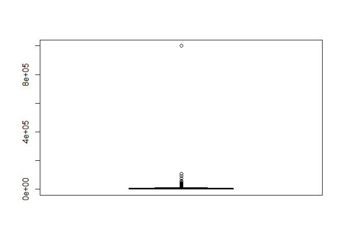
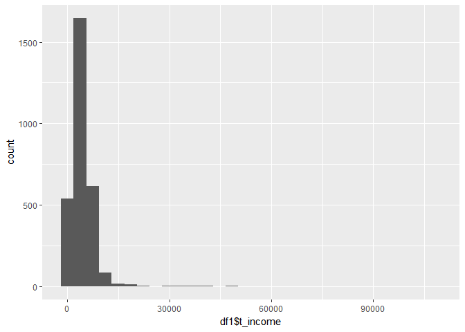
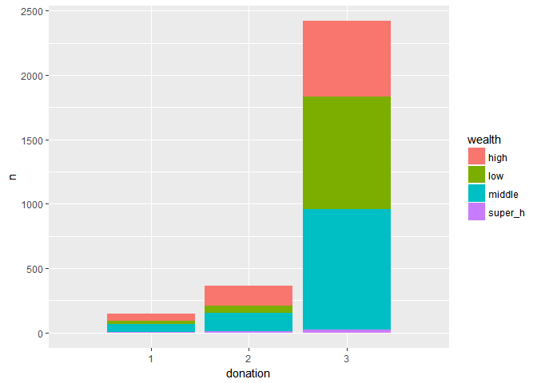
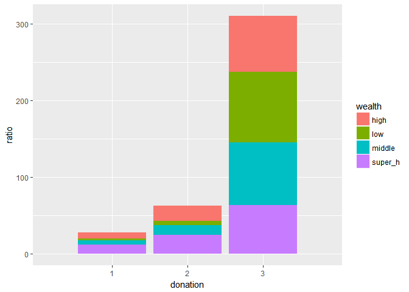

소득분위에 따른 기부빈도
================

1. 요약
-------

소득분위에 따라 기부 경험의 빈도가 어떻게 달라지는지 알아보기 위해 소득분위를 특정 기준^1 에 따라 나누었고, 기부 경험이 있는지에 대한 문항을 답변에 따라 묶은 후에 앞서 나누었던 소득분위에 따라 몇 개의 해당 값이 있는지, 그 비율은 어느 정도인지 알아보았다. 그 결과를 표로 나타내었더니 소득이 많다고 기부를 저소득인 사람보다 더 하는 것이 아니라는 결론이 도출되었다.

2. 분석 주제
------------

기부는 정부의 돈을 사용하지 않고서도 계층 간 소득 및 빈부 격차를 줄일 수 있는 방법 중 하나이다. 그렇다면 일반적으로 돈의 흐름이 위에서 아래로 내려오는 것이 맞다. 그러나 요즘은 마치 고인 물처럼 돈의 흐름은 잘 순환되지 않고, 고소득층은 후대에도 고소득층. 저소득층은 후대에도 저소득층인 상황이다. 게다가 뉴스를 보면 고소득층들이 발생시키는 금전과 관련된 사회적 문제가 많이 나온다. 오히려 저소득층 할머니께서 십시일반 돈을 모아 기부했다는 뉴스를 더 종종 볼 수 있는 상황이다. 이런 상황에 연구자 본인은 의문점을 품고 고소득층으로 갈수록 기부의 비율이 적어지는 것이 사실인가를 알아보기 위해 소득분위에 따른 기부경험의 빈도를 조사하였다.

3. 데이터 선정
--------------

데이터는 교수님이 일괄적으로 주신 서울복지 실태조사 “2015\_서울복지실태조사\_데이터.xlsx" 을 사용했다. 이 데이터 안에서도 소득을 나타내는 변수 ‘B10\_Total’와 기부 경험 여부를 묻는 변수 ‘D15'를 주로 이용했다. 소득분위를 등급으로 나타낼 때에는 평균값으로 하기에는 구분이 너무 광범위해, 한국장학재단에서 제공하는 \[^1\]「2018년 2학기 학자금 지원을 위한 소득구간(분위) 경곗값」을 참고하여 분류하였다.

------------------------------------------------------------------------

\[^1\] <http://www.kosaf.go.kr/>

4. 데이터 분석
--------------

##### 4-1 데이터 전처리

``` r
library(readxl)    #엑셀 파일을 불러들이기 위한 패키지 장착


# 분석할 데이터(엑셀파일) 불러오고 복사본 만들기
# 데이터 파일명이 한글로 되어 있어 잘 열리지 않아 원 이름인 '2015_서울복지실태조사_데이터.xlsx'을 'data.xlsx'로 임의 변경하였다.


df <- read_excel("data.xlsx")
df1 <- df

library(ggplot2)
library(dplyr)     #필요한 패키지 장착

# 필요한 변수만 추출

df1 <- df1 %>% 
  select(ID, B10_Total, D15)

# 변수명 바꾸기 

df1 <- rename(df1, t_income = B10_Total, donation = D15)
```

##### 4-2 데이터 파악 & 클린징

``` r
# 데이터 파악

View(df1)
str(df1)
```

    ## Classes 'tbl_df', 'tbl' and 'data.frame':    3019 obs. of  3 variables:
    ##  $ ID      : num  2 3 4 5 6 7 8 9 10 11 ...
    ##  $ t_income: num  0 999999 999999 5450 5800 ...
    ##  $ donation: num  3 3 3 2 3 3 3 3 3 3 ...

``` r
# 결측치 확인

table(is.na(df1$t_income))
```

    ## 
    ## FALSE 
    ##  3019

``` r
table(is.na(df1$donation))
```

    ## 
    ## FALSE 
    ##  3019

``` r
boxplot(df1$t_income)$stats  # 이상치 제거를 위해 boxplot을 이용해 극단치 경계를 알아보기
```



    ##       [,1]
    ## [1,]     0
    ## [2,]  2400
    ## [3,]  4000
    ## [4,]  6000
    ## [5,] 11200

boxplot을 통해 상하 극단치 경계가 '0', '11200'이라는 값이 나왔지만 '11200'은 분석 대상이 연간 총 소득이라는 점을 감안해 결측치가 아닌 것으로 간주하였다

``` r
max(df1$t_income)            # max, min 으로 t_income변수에 '0'과'999999'값이 있다는 것을 파악.
```

    ## [1] 999999

``` r
min(df1$t_income)
```

    ## [1] 0

``` r
# 결측치 제거

df1$t_income <- ifelse(df1$t_income == 0 | df1$t_income == 999999, NA, df1$t_income)
df1 <- df1 %>% 
  filter(!is.na(t_income))    # '999999'는 모름의 응답값이므로 결측처리하여 제거
```

##### 4-3 소득분위에 따른 기부 경험 빈도 파악

``` r
# 소득분위를 나누는 변수 추가

qplot(df1$t_income) # 소득분위의 분포를 알아봄
```



``` r
df1 <- df1 %>%
  mutate(wealth = ifelse(t_income < 3000, "low",
                         ifelse(t_income < 5400, "middle",
                                ifelse(t_income < 18000, "high", "super_h"))))

table(df1$wealth)
```

    ## 
    ##    high     low  middle super_h 
    ##     802     950    1150      33

table(df1$wealth)를 통해서 이 복지 설문에 응답한 가구의 소득분포가 middle &gt; low &gt; high &gt; super high 순으로 많음을 알 수 있었다.

``` r
# 소득에 따른 기부 경험 빈도 알아보기 

df2 <- df1 %>% 
  group_by(wealth, donation) %>% 
  summarise(n = n())

# 그래프로 나타내기

ggplot(data = df2, aes(x = donation, y = n, fill = wealth)) +
  geom_col() +
  scale_x_discrete(limits = c(1, 2, 3))
```



그래프를 통해 보면 일단 소득과 상관 없이 '3'의 값(기부한적이 없다)에 대한 응답이 압도적으로 많음을 알 수 있다. '3'을 선택한 사람의 수는 middle &gt; low &gt; high &gt; super high 순인것을 알 수 있다

##### 4-4 소득분위에 따른 기부 경험 비율 파악

``` r
# 소득별 기부 경험 비율 구하기

a <- df2 %>% 
  filter(wealth == "high") %>% 
  mutate(ratio = n/802*100 )

b <- df2 %>% 
  filter(wealth == "low") %>% 
  mutate(ratio = n/950*100 )  

c <- df2 %>% 
  filter(wealth == "middle") %>% 
  mutate(ratio = n/1150*100 )

d <- df2 %>% 
  filter(wealth == "super_h") %>% 
  mutate(ratio = n/33*100 )

df3 <- bind_rows(a, b, c, d)

ggplot(data = df3, aes(x = donation, y = ratio, fill = wealth)) +
  geom_col() +
  scale_x_discrete(limits = c(1, 2, 3))
```



분석 결과를 통해 보면 각 소득별 '3'을 선택한 사람의 비율은 앞서 구한 사람 수 값과 달리 low &gt; middle &gt; high &gt; super high 순인것을 알 수 있다.

또한, 소득별 기부를 하는 혹은 했었던 사람의 비율이 'low'등급은 약 7%, 'middle'등급은 약 17%, 'high'등급은 약 26%, 'super high'등급은 약 36%로 `고소득층`으로 갈 수록 기부를 하는 `비율`이 `높아짐`을 알 수 있다.

5. 논의
-------

#### 한계점

------------------------------------------------------------------------

이 분석의 한계점은 총소득에 포함되는 가구원과 기부 경험을 묻는 질문에 응답하는 가구원의 충돌이 있다는 점이다. 연간 총소득을 나타내는 변수 t\_income은 가구원들의 총 소득을 모두 합친 값이지만 기부 경험을 묻는 변수 donation은 질문의 주체가 '귀하'라고 되어 있으므로 응답자의 생각만 포함 된 결과이다. 가구의 소득이 높다고 해서 응답자의 소득이 높다고 파악 할 수는 없기 때문에 응답자의 가구원 번호를 따져 개개인의 소득을 파악했으면 결과가 달라질 수 있다는 한계가 있다. 또한 기부 경험에 대한 응답 기준 자체가 '최근 1년간'이라는 기간의 제약이 있기 때문에 소득에 따른 기부 경험이 어떻다 섵불리 일반화 할 수 없다.

#### 추후 분석 방향

------------------------------------------------------------------------

위의 한계점을 보완하는 방법으로는 설문지 응답자의 가구원 번호를 파악한 후 가구주와의 관계를 파악해 그와 맞는 소득 값을 구해 재 분석에 들어가는게 좋을 것이다. 또한

추가로 소득별 직종도 파악 해 기부를 많이 하는 직종은 어떤 것인지, 전문직일 수록 소득이 안정적이기 때문에 기부를 많이 하는지와 관련한 상관관계를 알아보면 좋을 듯 하다.
